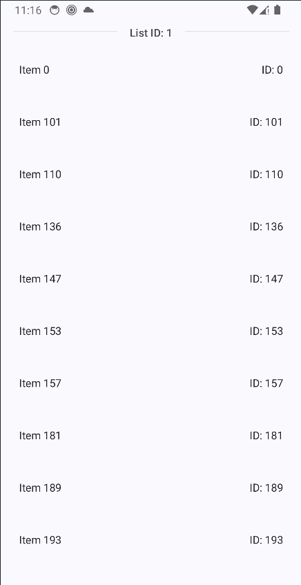
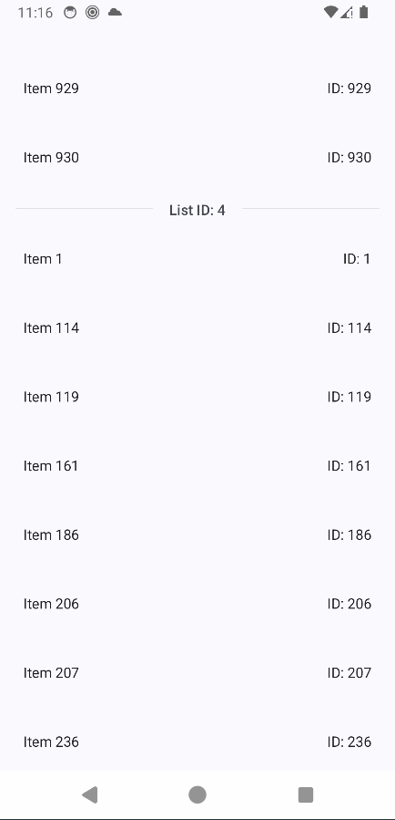

# Fetch Assessment App
This app retrieves a list of rewards from https://fetch-hiring.s3.amazonaws.com/hiring.json and displays them to users according to these rules:
* The rewards are grouped by their "listId."
* They are displayed in a sorted order, first by "listId" and then by "name."
* Any items without a name are left out.

# Screenshots
)

# Overview MVVM Clean Architecture
**Fetch Assessment** is built based on MVVM Clean Architecture suggested by Google for the best practice Android Development. This target of architecture allows the app to scale, increases the app's robustness, and makes the app easier to test.
Based on these principles:
- [Separation of concerns](https://en.wikipedia.org/wiki/Separation_of_concerns): is the most important principle in Android particularly, in software developement general.
  It leads to creating a project with less conflict or overlapping between code implementation, and business logic as possible.
  To follow the rule, developers must answer questions for **What** of code implementation. Based on that, developers can define which implementations work with which concerns.
- Scalability: break down parts into modules, so we can easily switch between modules to adapt development.
- Testability:
- Lifecycle Awareness:
- Reusability:
- Maintainability:
- Improve Collaborations: everything breaks down into small modules. From then, developers can work independently, and reduce conflicts in development as much as possible.

## Components

To build the architecture, we need to learn and use those following components:
* **Kotlin Coroutines and Flow**: manage asynchronous operations efficiently, ensure smooth user experiences.
* **Jetpack Compose**: a modern Android UI toolkit that simplifies the process of building beautiful and dynamic user interfaces through a declarative and composable approach.
* **Hilt**: dependency injection
* **ViewModel**: stores and manage UI-related data
* **StateFlow**: helps in propagating changes in a reactive and efficient manner
* **Repository and Remote/Local Data Source**: employs Retrofit and Gson to interact with remote data sources and retrieve data efficiently.
* **UseCase**: A dedicated UseCase is implemented to fetch rewards from the Data and handle business logic according to predefined rules, promoting a clear separation of concerns.

## Data Flow

## Module Dependencies

