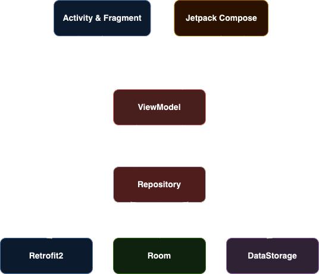
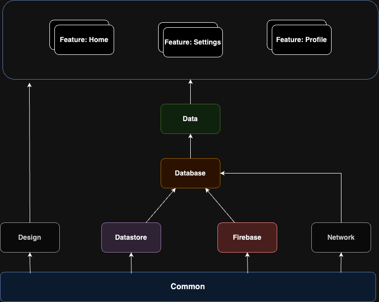

# Overview MVVM Clean Architecture

**Fetch Assessment** is built based on MVVM Clean Architecture suggested by Google for the best practice Android Development. This target of architecture allows the app to scale, increases the app's robustness, and makes the app easier to test.
Based on these principles:
- [Separation of concerns](https://en.wikipedia.org/wiki/Separation_of_concerns): is the most important principle in Android particularly, in software developement general.
  It leads to creating a project with less conflict or overlapping between code implementation, and business logic as possible.
  To follow the rule, developers must answer questions for **What** of code implementation. Based on that, developers can define which implementations work with which concerns.
- Scalability: break down parts into modules, so we can easily switch between modules to adapt development.
- Testability:
- Lifecycle Awareness:
- Reusability:
- Maintainability:
- Improve Collaborations: everything breaks down into small modules. From then, developers can work independently, and reduce conflicts in development as much as possible.

## Components

To build the architecture, we need to learn and use those following components:
- Dagger: dependency injection
- Retrofit: calling api
- Room: storing local data (such as: newsfeed, news detail,...)
- DataStore (SharePreference): storing user and system information
- RxKotlin / Coroutine Flow: handle asynchronous tasks
- Flow / State / StateFlow: handle UI state

## Data Flow

## Module Dependencies

